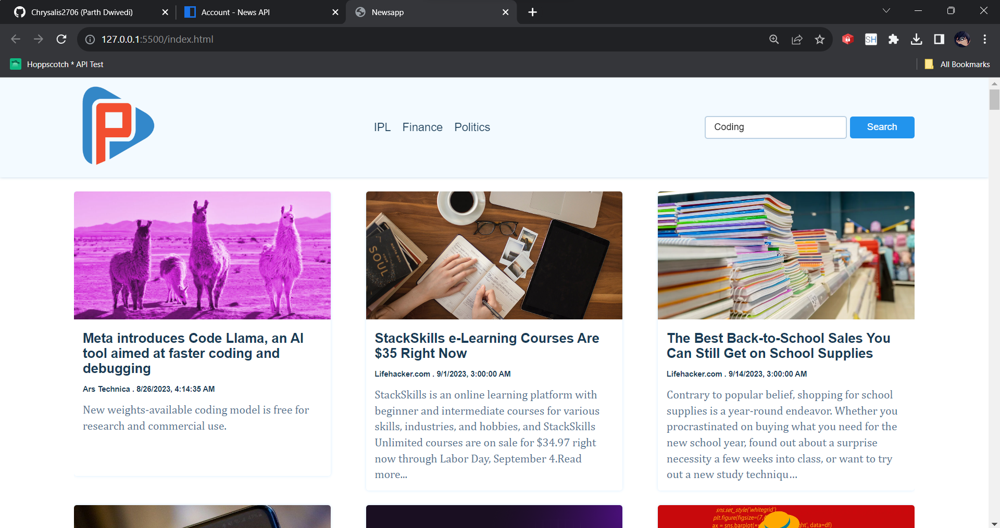

## JS+API Project - 1

[News API](https://newsapi.org/)

> Kindly API Key from this website and paste it in the 'apiKey' variable value in script.js file.

### Overview

This is a JavaScript mini project created by Parth that allows users to search for news articles related to a specific keyword. The project utilizes the News API to fetch and display news articles based on user input.

### Preview

### How to Use

> Open the index.html file in your web browser.  
> In the search bar, enter the keyword or topic you want to search for.  
> Hit the "Search" button.  
> The project will fetch and display a list of news articles related to the keyword you entered.
